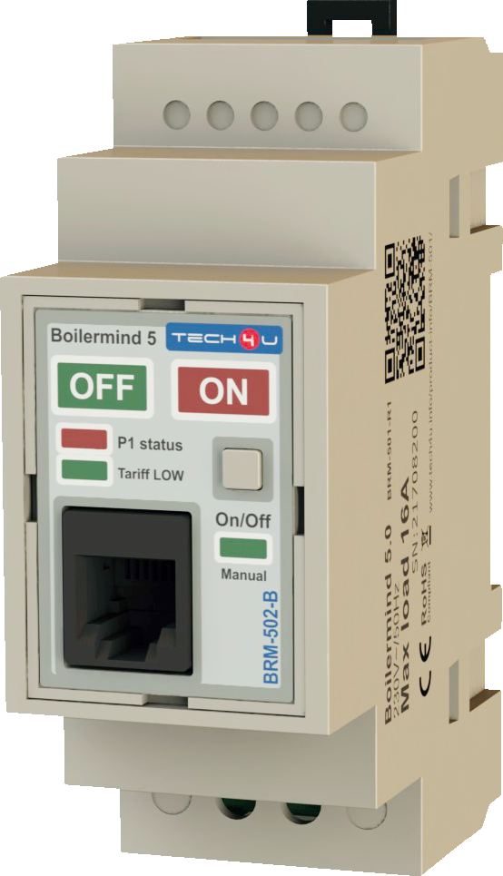
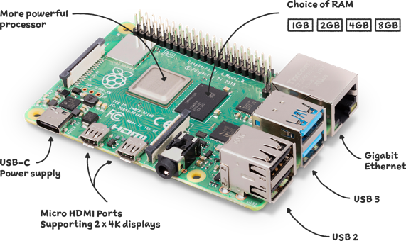
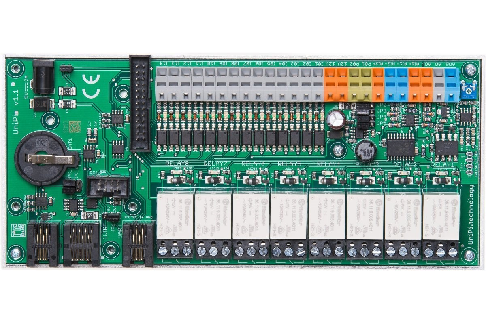
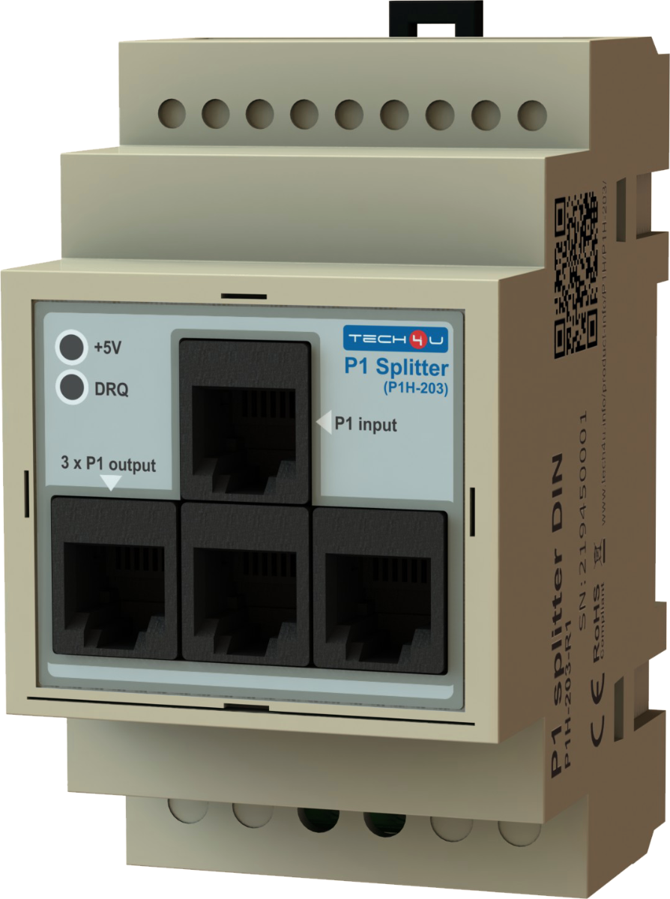
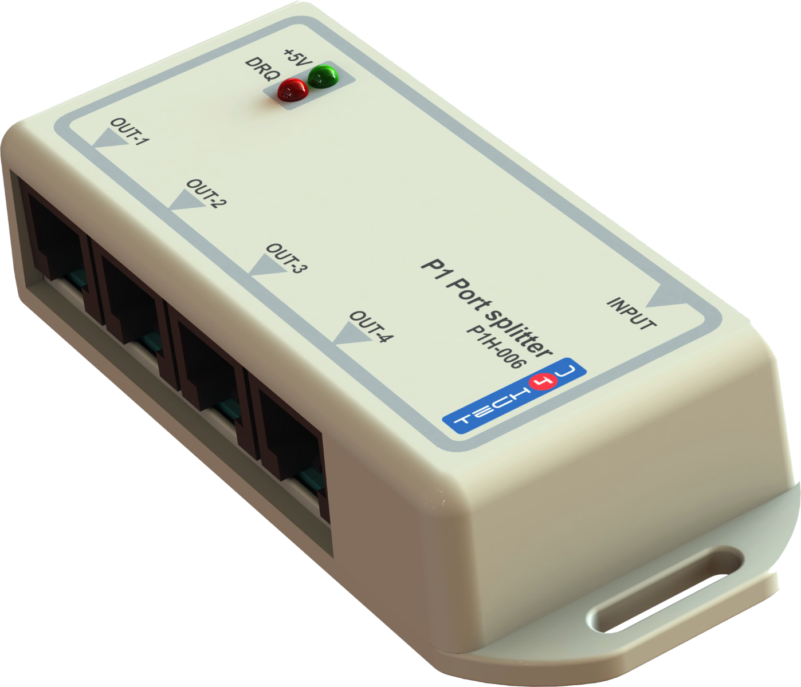
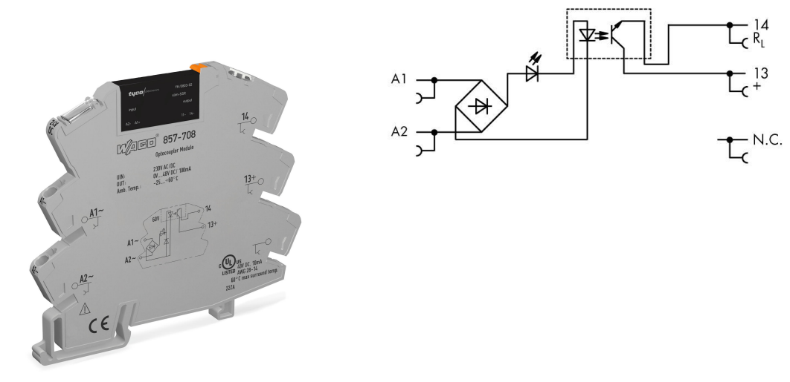
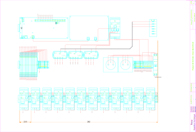

= Test du relais tarifaire TECH4U Boilermind BRM-502-B sur port P1
:toc:
:toc-title: Table des matières
:sectnums:
//:media: prepress

== Versioning
=== Historique du document
[cols="^1,^1,^1,4"]
|==========
|Date|Firmware Version|Document version|Description

|2020-12-08|0.9|v0.01 draft|Document initial
|==========

=== Liste de distribution
Personnel technique Resa.

=== Documents liés
[cols="^1,1,1]
|==========
|Nom fichier | Description
|BRM-501__User_Guide_NL_R2.pdf | TECH4U BRM-501 Boilermind 5.0 - User Guide - Néerlandais
|Flyer_BRM-501_Boilermind_Rev_A_NL.pdf | TECH4U BRM-501 Boilermind 5.0 - Flyer - Néerlandais
|FLU20IT017_TE-881.4-K01_TLB_E-TSD Digital Direct Electricity Meters_E.2.0_TC.docx | Spécification demandées pour SmartMeter
|==========

=== Support technique
Expertise Technique & SmartMeter +
technicien: Eric ALBERT +
email: eric.albert@resa.be

== Objectif du tests
Le but du test est d'évaluer la durée de vie et la fiabilité des relais Boilermind de TECH4U. +
Ces relais sont des relais physiques branchés sur le port P1 des compteurs SmartMeter et permettent de bénéficier d'un contact sec image de l'information Tarif sortant du port P1. +

== Données techniques du relais TECH4U BRM-502-B Boilermind 5.0

[cols="^1,1]
|==========
|Convient pour le protocole SmartMeter:         |DSMR 5.0 version Belge
|Installation:                                  |DIN-RAIL, 35 mm
|Tension utilisable:                            |100 -240 V/AC, 50/60 Hz
|Consommation électrique P1:                    |max: 130 mA
|Tension de commutation:                        |250 V/AC
|Tension max. de commutation:                   |440 V/AC
|Courant de fonctionnement (capacité) AC1:      |16 A / 250 V AC
|Puissance de fonctionnement (capacité) AC3:    |750 W (moteur monophasé)
|Courant maximal:                               |16 A
|Courant max. mise sous tension:                |30 A
|Durée de vie mécanique (nbr de commutation):   |> 0.7 x 10e5 (at 16 A, 250 V/AC) = 70000 commutations
|Distributeur de protection externe recommandé: |B16A, 250 V (for resistive load)
|Exigence pour les fils de connexion:           |2,5 mm²
|Température de fonctionnement:                 |+5 tot +40°C
|Température de stockage:                       |-10 tot +60°C
|Humidité:                                      |Max. 90% rel. humidité, sans condensation
|Dimensions:                                    |120 x 86 x 52,5 mm
|Poids:                                         |90 g
|Garantie:                                      |2 Jaar
|==========

Le TECH4U BRM-501 Boilermind 5.0 est la version hollandaise du relais. +
Le TECH4U BRM-502-B Boilermind 5.0 est la version Belge du relais (T1 = tarif jour = ouvert, T2 = tarif nuit = fermé)

== Durées de vie théorique
=== Durées de vie théorique du TECH4U BRM-502-B Boilermind 5.0
[cols="^1,1]
|==========
|Durée de vie mécanique (nbr de commutation):   |> 0.7 x 10e5 (at 16 A, 250 V/AC) = 70000 commutations
|Température de fonctionnement:                 |+5 tot +40°C
|Température de stockage:                       |-10 tot +60°C
|Humidité:                                      |Max. 90% rel. humidité, sans condensation
|==========

=== Durées de vie théorique du SmartMeter Sagemcom

[cols="^1,1]
|==========
|Expected life span                                 |at least 15 years, starting installation date
|Operating temperature range of at least            |-10°C to +40°C
|Limit temperature range of operation of at least   |-25°C to +70°C
|Storage temperature range of at least              |-25°C to +70°C
|==========

== Tests, dureé
Il semble souhaitable que les contacteurs aient une durée de vie au moins équivalente à celle des compteurs. +
Les SmartMeter ont une durée de vie de minimum 15 ans = 5475 jours. +
Si le relais commute 2 fois par jour (matin=off, soir=on) cela demande une quantité de commutations minimale de 5475 jours X 2 commutations = 10950 commutations minimum. +
Comme les relais ont une durée de vie de 70000 commutations, la durée de vie théorique du relais est au moins 6 fois supérieure à celle du compteur. +

Pour tester les relais:

* si nous faisons commuter le relais toutes les minutes, la durée du test total serait de 10950 commutations/1440min = 7,6 jours. +
* si nous faisons commuter le relais toutes les secondes, la durée du test total serait de 10950 commutations/86400sec = 3,041 heurs.

== Tests, matériel
Il faudrait donc pouvoir envoyer des trames sur le port P1 rapidement, par exemple toutes les secondes. +
C'est quasiment impossible de le faire avec un compteur. Cela nécessiterait une programmation spéciale. Ce qui est difficile à réaliser. +

Le mieux est de concevoir un générateur de trames identiques au port P1 qui serait programmable à souhaits. +

Le choix a été fait du matériel de test suivant:

* un RaspberryPi avec carte d'interface entrées/sorties qui servira à:
** générer les trames data du port P1 par programmation
** lire les sorties des contacts des Boilermind pour vérifier leurs bonnes commutations
** archiver les événements et statistiques ce test
* un convertisseur électronique des niveaux de sortie de l'UART du RPi vers des niveaux de sortie semblable à ceux du compteur
* des splitters pour diviser la sortie unique du convertisseur type compteur vers 12 entrées (1 par appareil à tester)
* 12 Boilermind 5.0 version Belge qui recevront les trames port P1
* 12 convertisseurs 220VCA qui liront les sorties des Boilermind (contact sec) et adapteront les signaux pour les rendre compatible avec les entrées de contrôle du RPi

=== Le Raspberry Pi

Le Raspberry Pi est un modèle 4 avec 4GB de RAM. +
L'OS installé est le Raspberry Pi OS 10 (Buster).

=== La carte d'interface entrées/sorties

La carte d'interface choisie est l' *Unipi 1.1 d'Unipi technology* qui comprend notamment:

- Relays: 8 relais 250VAC@5A ou 24VDC@5A
- UART port: 1 port série standard (0-5V) sur connecteur RJ11
- 1Wire port: interface 1Wire (0-5V) sur connecteur RJ45
- I2C port: port I2C (0-5V) sur RJ11
- RTC module: real time clock avec batterie de sauvegarde
- Power 5V: alimentation 5V de puissance sur connecteur rond 2.1mm
- RPI connector: connecteur 26pins pour connecter le RPi à la carte Unipi 1.1
- Digital inputs: 12(+2) entrées digitales isolées galvaniquement
- 12V out power supply: 12v@200mA à utiliser avec les entrés digitales
- Analog in: 2 entrées analogiques 0-10V
- Analog out: 1 sortie 0-10V
- AO trimmer: pour ajustement précis de la sortie analogique

Dimension de la carte 198mmx86mm +
Site web unipi: https://www.unipi.technology

=== Le convertisseur UART > P1
Le convertisseur USB > P1 de Tech4U n'étant pas disponible lors au début de nos tests, nous avons développé notre propre convertisseur. +
Il convertis les signaux 0-5V de l'UART du RPi (disponibles sur le RJ11 de la carte d'interface) en un signal isolé optiquement disponible sur un connecteur RJ12 identique à celui du compteur. +
Une alimentation de 5V est également disponible sur ce même RJ12 comme spécifié dans les spécifications du port P1. +

image::./schema/P1_port_sender.pdf[convertisseur UART > P1,200,align="center"]
Le schéma du convertisseur UART > P1 link:./schema/P1_port_sender.pdf[P1_port_sender.pdf] +

=== Les splitters port P1
Le convertisseur dispose d'une seule sortie port P1 sur RJ12. +
Il faut envoyer les trames port P1 vers 12 Boilermind 5, il nous faut donc 12 sorties RJ12, un/des splitters sont donc nécessaires.

Nous avons utilisé un premier splitter pour rail DIN, 1 entrées et 3 sorties, le *Tech4U P1 port splitter DIN (1A) (P1H-203-1A)*.

Chaque sortie de ce splitter est entrée dans un splitter 'volant', 1 entrée et 4 sorties, le *Tech4U P1 port splitter 4x (P1H-006)*.

Nous avons donc nos 3x4=12 port P1 à envoyer vers les Boilermind 5.

=== Les Boilermind 5.0
Le Boilermind est le relais à tester

Il s'agit d'un appareil pour rail DIN qui analyse les trames du port P1 et réagit à la ligne Tarif de la trame en ouvrant ou fermant son relais. +
Dans sa version Belge (-B) le relais est ouvert lorsque le tarif est T1 (jour) et fermé lorsque le tarif est T2 (nuit).

=== Les convertisseurs 220VCA > entrées RPI
Nous avons choisi le Solid State Relay Wago 857-708

[cols="^1,1]
|==========
|Nominal input voltage Un:                      |220 V AC/DC
|Input voltage range (low level):               |0 ... 30 V AC/DC
|Input voltage range (high level):              |200 ... 253 V AC/DC
|Nominal input current at Un:                   |3.25 mA
|Limiting continous current:                    |0.1 A
|Turn-on time:                                  |< = 100 µs
|Drop-out time:                                 |< = 600 µs
|Switching frequency:                           |< = 1 kHz
|Status indicator:                              |LED yellow
|degree of protection:                          |IP20
|==========
Toutes les données techniques link:./doc_tech/wago-Relay_220V_OC_857-708.pdf[wago_857-708] +

== Tests, assemblage
Voici le schéma de d'assemblage et de raccordement des divers matériels pour le test des relais Boilermind

image::./schema/Plaque_montage_P1_test_relay_12_relays.pdf[Plaque_montage_P1_test_relay_12_relays,600,align="center"]

* le raspberryPi est monté sur la carte d'interface
* la sortie UART (RJ12) de la carte d'interface est raccordée à l'entrée de la carte convertisseur (RJ12)
* la sortie port P1 (RJ12) de la carte convertisseur est raccordée à l'entrée du Splitter P1H-203-1A (id=SP1)
* la sortie 1 du P1H-203-1A est raccordé à l'entrée INPUT du premier splitter (id=SP2)
* la sortie 2 du P1H-203-1A est raccordé à l'entrée INPUT du second splitter (id=SP3)
* la sortie 3 du P1H-203-1A est raccordé à l'entrée INPUT du troisième splitter (id=SP4)
* la sortie OUT 1 de SP2 est raccordée au Boilermind 1 (id=BM1)
* la sortie OUT 2 de SP2 est raccordée au Boilermind 2 (id=BM2)
* la sortie OUT 3 de SP2 est raccordée au Boilermind 3 (id=BM3)
* ...
* la sortie OUT 4 de SP4 est raccordée au Boilermind 12 (id=BM12)
* les premières bornes des relais de sortie des BMx sont raccordées à la Phase de l'alimentation 220VCA (Ph)
* les secondes bornes des relais de sortie des BMx sont raccordées aux bornes A1 d'entrée des convertisseurs Solid State Relay Wago (entrées 220VCA)
** borne sortie relai BM1 > A1/R01
** borne sortie relai BM2 > A1/R02
** ...
** borne sortie relai BM12 > A1/R12
* les bornes A2 des SSR Wago sont raccordées au Neutre (N) du 220VCA
* les bornes 14 des SSR sont raccordées aux entrées binaires de la carte d'interface du RPi
** borne 14/R01 > I01 carte interface
** borne 14/R02 > I02 carte interface
** ...
** borne 14/R012 > I12 carte interface

*ATTENTION:* +
Le splitter SP1 doit être alimenté en 220VCA. +
Les splitters SP2, SP3, SP4 *doivent être alimentés via leur port USB*, sinon la transmission des messages sur les ports P1 de sortie ne sont ni stables ni régulières. +

== Tests, procédure de test
Le programme du RPi générant les trames P1 est rédigé en Python 3.7. +
Il génère alternativement des trames P1 avec un tarif T1 puis un tarif T2 et ainsi de suite. +
La pose entre des envois successifs des trames est de 1s. +
Il faut donc un peu plus de 1s (1s de pose + envoi de la trame) entre 2 envois de trames P1. +
Lorsqu'une trame est envoyée, elle l'est sur tous les relais. On scanne les entrées des SSR pour voir s'il y a un changement de son état et si l'état lu correspond bien au tarif envoyé. +
Le tarif T1 (jour) ouvre le relais du Boilermind qui désactive le SSR qui désactive l'entrée de la carte d'interface. +
Le tarif T2 (nuit) ferme le relais du Boilermind qui active le SSR qui active l'entrée de la carte d'interface. +

Le programme log chaque émission des trames. +
Le programme log chaque modification de d'une entrée de la carte d'interface. +
Un compteur logiciel enregistre chaque émission P1/lecture entrée effectuées avec succès. +
Un compteur logiciel enregistre chaque émission P1/lecture entrée NON effectuées avec succès. +
Un compteur logiciel enregistre le nombre d'émissions consécutives maximum en échec. En effet si une émission rate, une émission est émise la seconde suivante et si cette dernières réussi, le problème n'est pas trop grave.
Par contre, si un nombre important d'émissions successives ratent, cela peut nuire au bon fonctionnement de l'installation du client. +

Le programme est lancé au démarrage du RPi. En cas de coupure de courant, les envois reprennent donc automatiquement.

Aucune charge n'été mise sur la majorité des contact des relais Boilermind. +
La seule charge des contacts est celle des entrées des SSR. +
Seuls les contacts des Boilermind BM1, BM3, BM6, BM8 et BM12 on une lampe led de 3.6W() comme charge. +

== Tests, résultat des Tests
Le programme a tourné en continu pendant plusieurs semaines. +
Un nombre total de 827068 émissions/lectures ont été effectuées. +
Aucune émission/lecture n'a échouée. +
*On peut donc en déduire que le Boilermind est un produit fiable.* +

*Disfonctionnements constatés:* +
Lors du test du programme de test, on a parfois du couper le programme à un moment quelconque de son exécution, peut être en cours d'envoi d'une trame. +
Dans certain cas, des Boilermind ont planté lors de la relance du programme. Seul un reset hardware des Boilermind, enlever et remettre le RJ12, permet de les débloquer. +
Il faut noter que ces cas ne devraient jamais arriver lors de conditions d'utilisations normales puisque une coupure de courant qui provoquerait une coupure de l'émission de trames P1, reseteraient également le Boilermind.

*Cependant, ces cas de disfonctionnement doivent être remontés au fournisseur. Il est en effet impossible de garantir que des trames venant des compteurs ne pourraient jamais être interrompues de manière intempestives.* +
